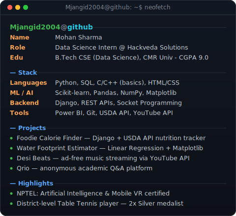

<table>
<tr>
<td valign="top"></td>
<td valign="top"></td>
</tr>
</table>

# Mohan Sharma

**Full-Stack Developer · ML Enthusiast · Open Source Builder**

 

<!-- animated contribution graph, refreshed daily by the workflow -->

